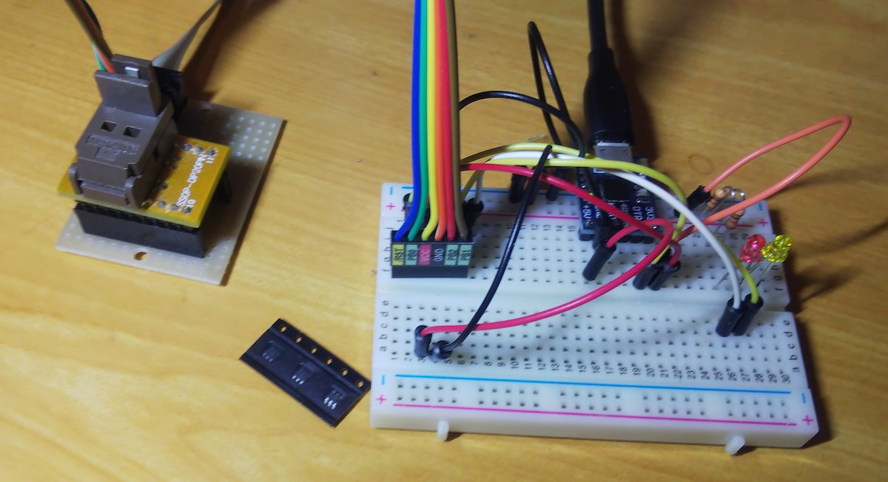

# DTRピンをつかったシリアル1ビット通信

シリアル通信のDTR信号をつかって、PCと1ビット通信を行います。DTRをLOWにした回数を数え、その結果で処理を行います。
マイコンのプログラミングの間になにか簡単な処理を挟みたい、シリアル通信とは別に簡単な通信を行いたい場合に便利です。

* きた信号の回数だけLED1が点滅します。10回信号がくるとLED2が点灯します。
* 信号は100ミリ秒の間に送信します。

* マイコンはATTiny10、ホストはmacOSまたはLinuxです。
* DTRピンのある任意のUSB-UARTアダプタを使用してください。
* ATTiny10のプログラム電圧は5Vです。USB-UARTアダプタが3.3Vの場合、都度つなぎ替える必要があります。
* DTRは負論理です。LED1,LED2も負論理にしてあります。
* DTRピンとPB2, LED1をPB1, LED2をPB0に接続してください。
* VCC - 1kΩ抵抗 - アノード LED カソード - GND と言う風に配線してください。
* PB0に負荷があるのでLED2を外さないとプログラムに失敗します。
* [dtrflipper](./dtrflipper) はシリアルポートのDTRを任意の回数反転させます。

# 利用例

ATTiny10のコードのビルドとプログラミング

	$ make flash

dtrflipperのビルド

	$ cd dtrflipper

DTRを5ミリ秒間隔で5回Lowにする

	$ ./dtrflipper /dev/ttyUSB0 5 5 

DTRを5ミリ秒間隔で10回Lowにする

	$ ./dtrflipper /dev/ttyUSB0 5 10

